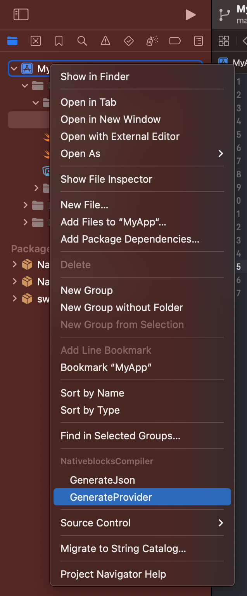
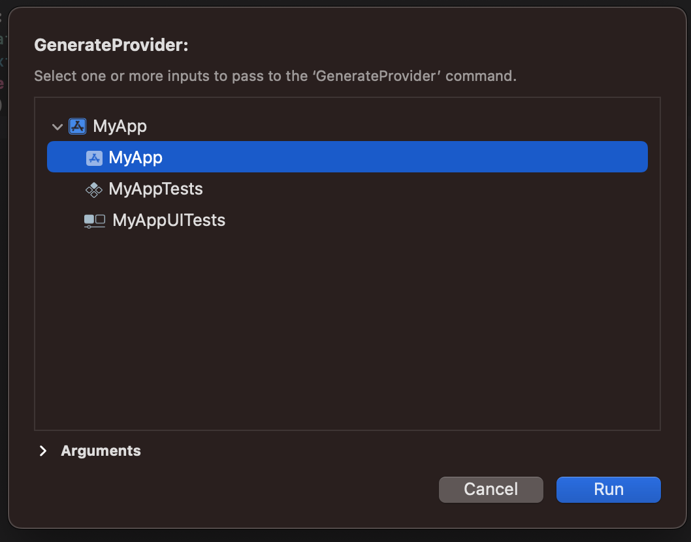
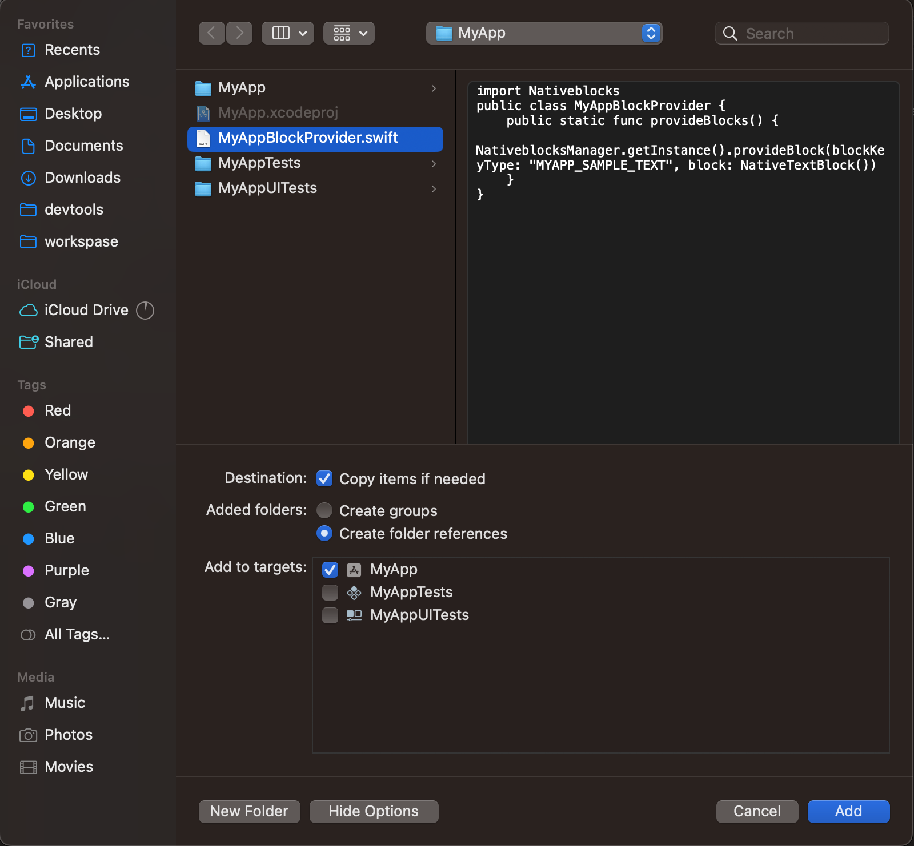
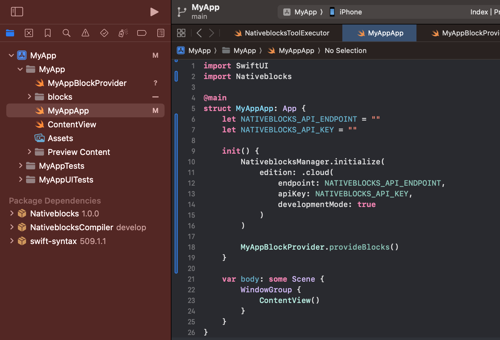
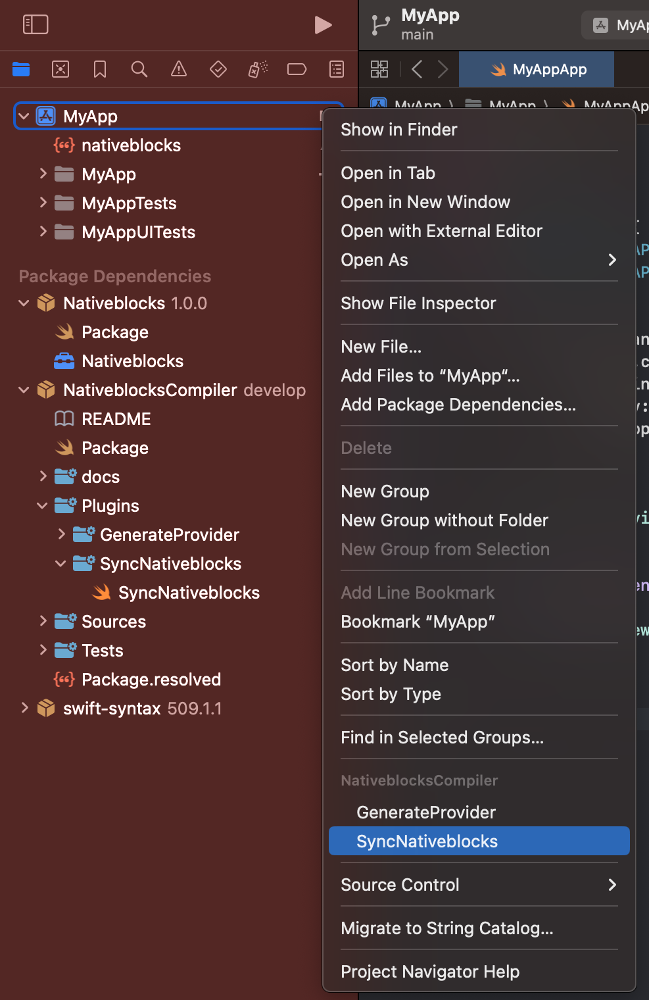
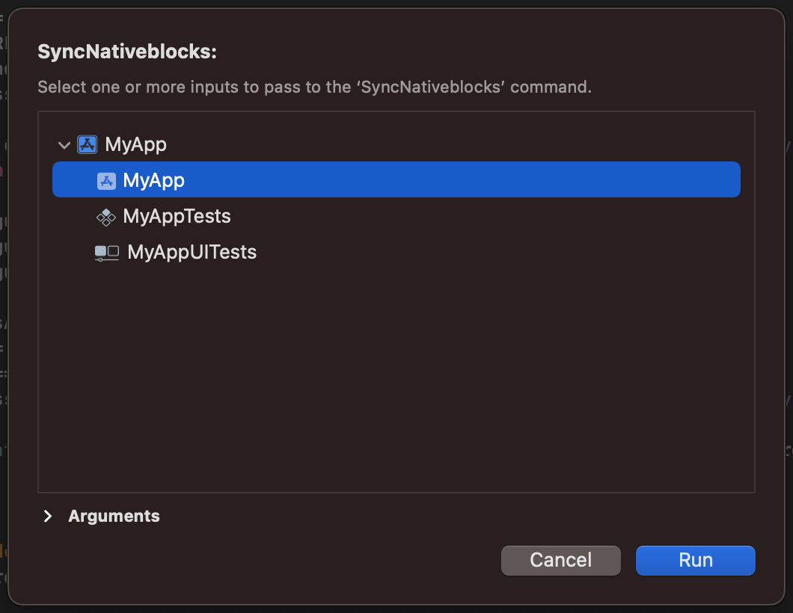

# Nativeblocks iOS Template

A template iOS project for integrating with Nativeblocks Studio.

## Prerequisites

- XCode
- iOS SDK (API level 15 or higher)

## Setup

### 1. Configuration

Update the `nativeblocks.json` file in the root of your project and add the following details:

```json
{
    "endpoint": "",
    "authToken": "",
    "organizationId": ""
}
```

These properties are specific to each Nativeblocks Studio account. You can find them in the **Link
Device** section of Nativeblocks Studio.

### 2. Build and Run

1. Open the project in Xcode
2. Sync the project
3. Build and run the application

## XCode Commands

### Generate Provider

After providing annotations for blocks and actions, you can use the `GenerateProvider` plugin to generate Swift code. These can then be initialized in App or via dependency injection

Note: The prefix for the provider name comes from the target name that was selected. In this case, since we
provided "MyApp," the
the compiler generates with the "MyApp" prefix.

```swift
MyAppBlockProvider.provideBlocks()
MyAppBlockProvider.provideActions()
```

1) Choose `GenerateProvider`



2) Select Target



3) Add `MyAppBlockProvider.swift` to Target



4) Use `MyAppBlockProvider`




### Sync

After providing annotations for blocks and actions, you can use the `Sync` plugin to sync blocks and actions with nativeblocks server.

It needed to provide compiler arguments, Properties belonging to each Studio account, from Nativeblocks Studio, find Link Device and copy properties to `nativeblocks.json` file.

1) Choose `Sync`



2) Select Target



## Dependencies

This template includes:

- **Nativeblocks iOS SDK** - Core integration
- **Nativeblocks Foundation** - Foundation components
- **Nativeblocks WandKit** - Debugging tool
- **Nativeblocks Compiler** - Annotation processing

## Getting Started

1. Clone this template
2. Configure your `nativeblocks.json` file
3. Build and run the project
4. Use the sync command to upload your configurations to Nativeblocks Studio

## Support

For more information and support, visit [Nativeblocks Documentation](https://nativeblocks.io).
